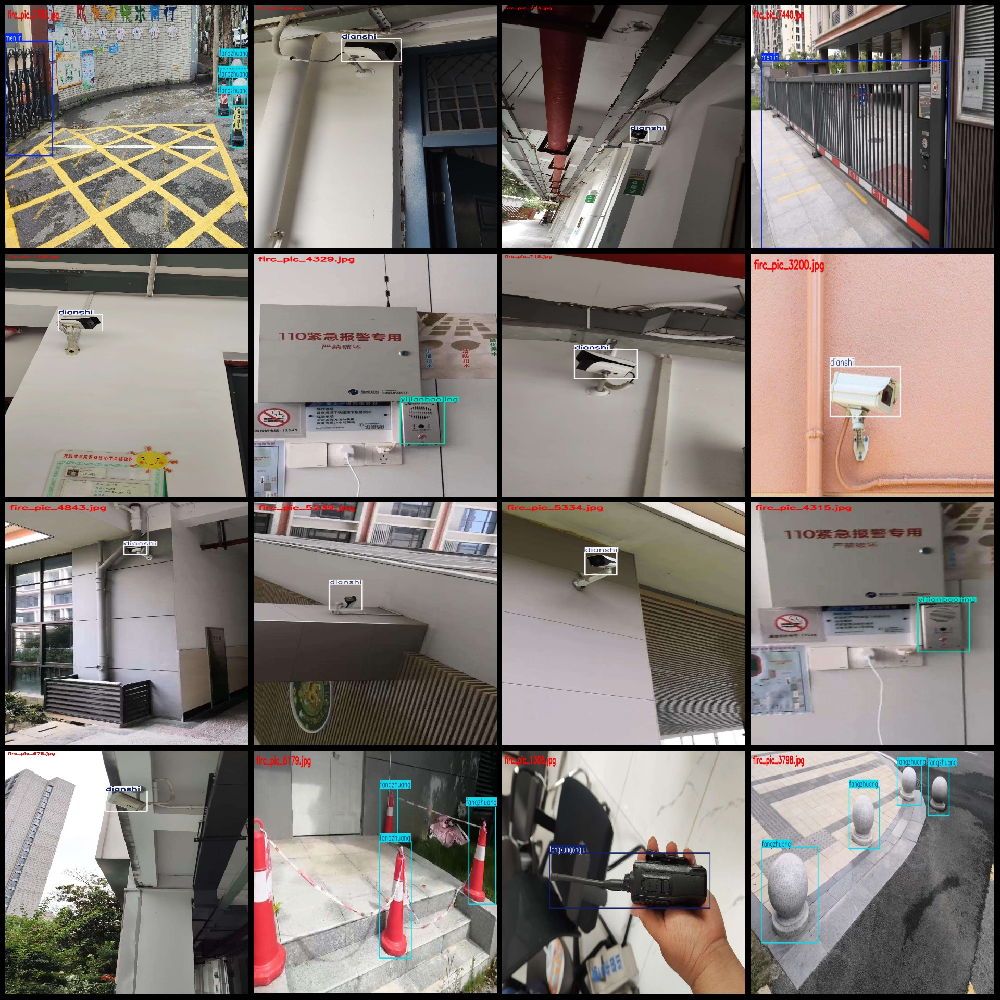
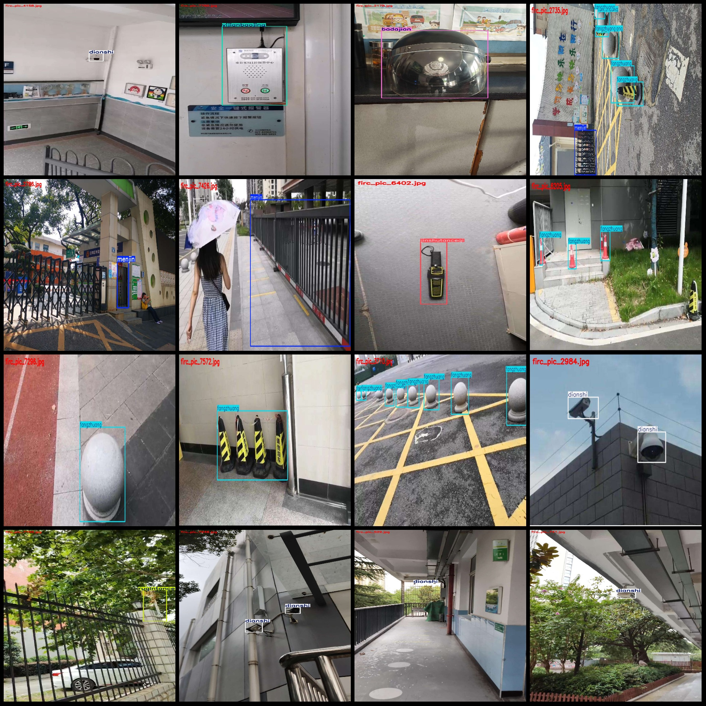

# Intelligent Campus Security Facilities Inspection Data Set - VOC+YOLO Format - 7896 Images with 12 Categories

Dataset format: Pascal VOC format + YOLO format (without split path's txt file, only contain jpg image and corresponding VOC format xml file and yolo format txt file)
number of images: 7896  
annotation count: 7896  
annotation count: 7896  
annotationnumber of classes: 12  
Annotation class names: ["badajian", "chuanghu", "dianshi", "fanghumen", "fangzhuang", "jinshutanceqi", "menjin", "ruqintance", "shitifanghu", "tongxungongju", "yijianbaojing", "yingjimen"]
["8 major items", "Window", "TV", "Protection door", "Anti-collision", "Metal detector", "Access control", "Intrusion detection", "Physical protection", "Communication tool", "One-button alarm", "Emergency door"]
boxes per class:   
badajian box count = 299  
chuanghu box count = 9  
dianshi box count = 5279  
fanghumen box count = 36  
fangzhuang box count = 4620  
jinshutanceqi box count = 784  
menjin box count = 675  
"ruqintance box count = 423" is not a mathematical problem, so it cannot be solved using standard mathematical operations or formulas. It seems to be a typographical error or a misinterpretation of the word "ruqintance." If you can provide more context or clarify what you are asking about, I may be able to assist you with a mathematical solution.
shitifanghu box count = 1  
tongxungongju box count = 98  
yijianbaojing box count = 257  
yingjimen box count = 41  
total boxes: 12522  
The number of images in each category:
The number of images owned by badajian is 228.
The number of images owned by Chuanghu = 8.
The number of pictures owned by Dianshi is 4135.
The number of pictures owned by Fanhumen is 35.
The number of pictures owned by Fangzhuang is 1563.
The number of pictures owned by Jinshutanceqi is 768.
The number of images owned by Menjin = 665.
Ruqintance has 234 images.
shitifanghu = 1
tongxungongju = 98
yijianbaojing = 254
yingjimen = 41
Image resolution: Multi-resolution images, such as 1024x1820, 1024x576 etc.
Labeling tool: labelImg
Labeling rules: Draw a rectangle box around the category.
Important Notice: The dataset does not have separate training validation test sets to be divided.
Special Disclaimer: This dataset does not guarantee the accuracy of the trained model or weight files.
Image preview:
## Images

Here is a pay link on Stripe ( https://buy.stripe.com/3cs8yP7sY87d0vu9AB ). Please contact me lonlonago@foxmail.com after funding $89, and I will send you a complete data files , thank you!

